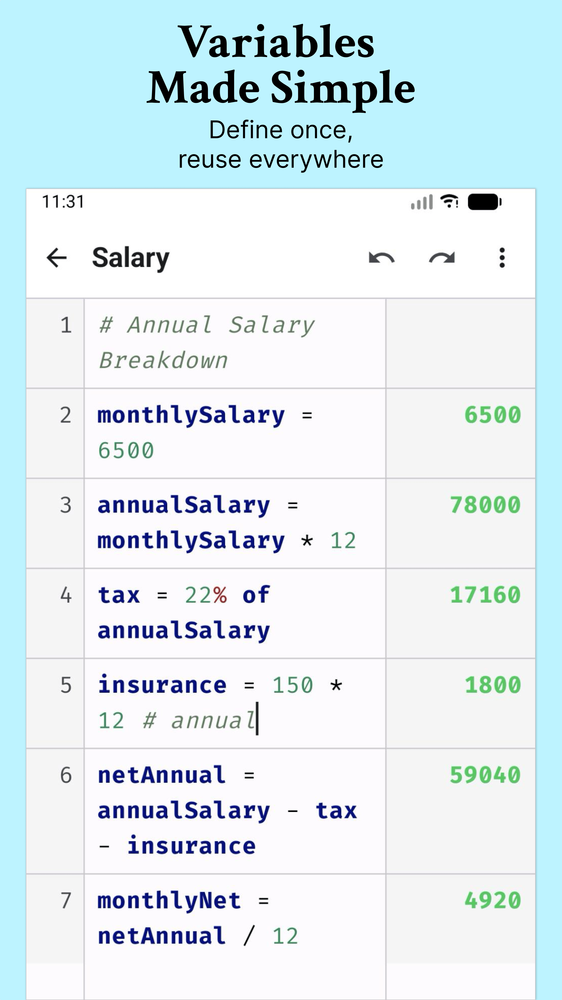
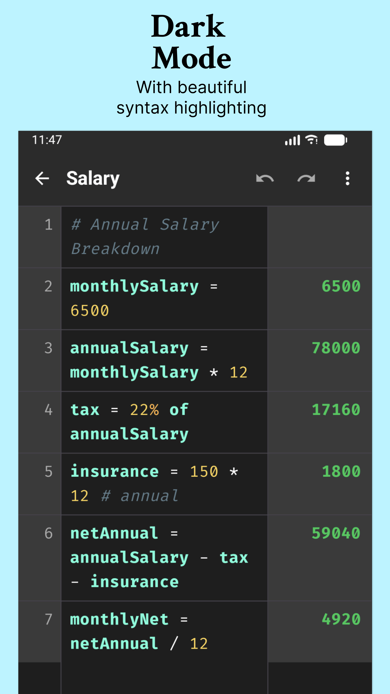
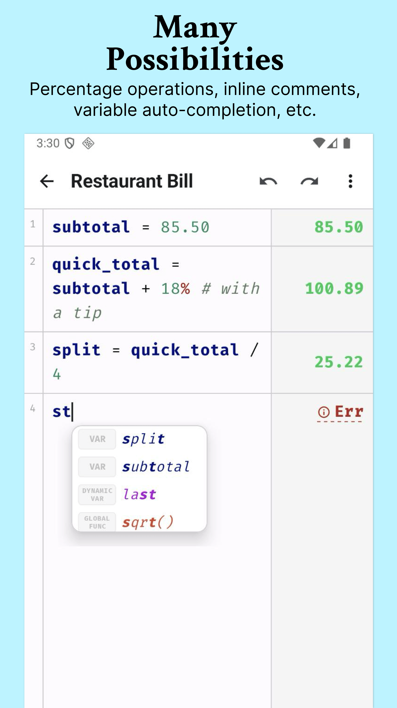
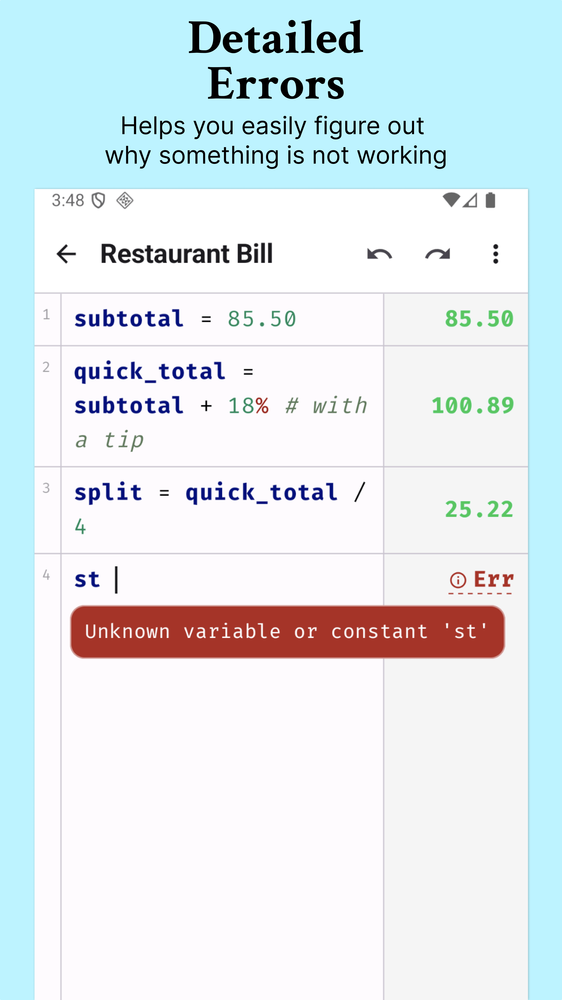
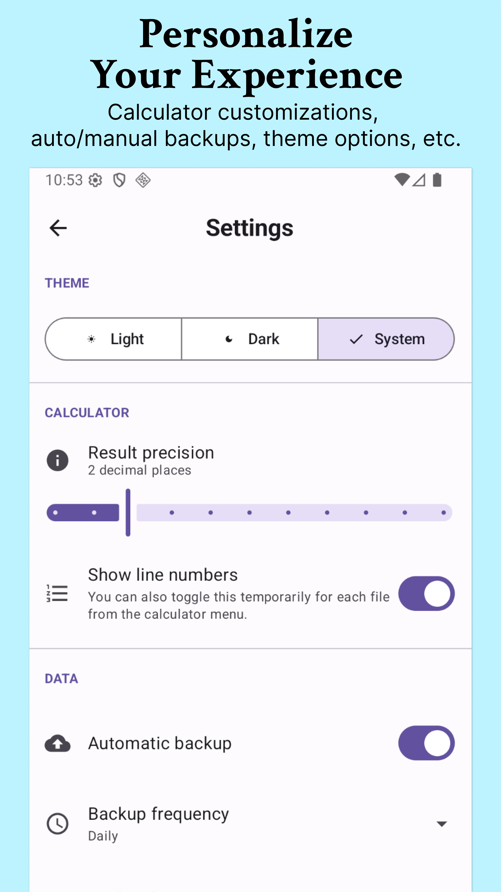

<h1 align="center">NerdCalci</h1>

<p align="center">
  
</p>

<p align="center">
  <strong>Fully offline Android calculator app for power users with variable support, syntax highlighting, file-based sessions, and more. A free Android alternative to proprietary text-based calculators like Numi, Calca, and Soulver.</strong>
</p>

[](https://play.google.com/store/apps/details?id=com.vishaltelangre.nerdcalci)
[](https://f-droid.org/packages/com.vishaltelangre.nerdcalci/)
[](https://apt.izzysoft.de/packages/com.vishaltelangre.nerdcalci)
[](https://apps.obtainium.imranr.dev/redirect?r=obtainium://app/%7B%22id%22%3A%22com.vishaltelangre.nerdcalci%22%2C%22url%22%3A%22https%3A%2F%2Fgithub.com%2Fvishaltelangre%2FNerdCalci%22%2C%22author%22%3A%22vishaltelangre%22%2C%22name%22%3A%22NerdCalci%22%2C%22supportFixedAPKURL%22%3Afalse%7D)
[](https://github.com/vishaltelangre/NerdCalci/releases)

## Screenshots

<p align="center">
  
  
</p>
<p align="center">
  
  
</p>
<p align="center">
  
  
</p>

## Features

### Smart Calculations

> [!NOTE]
> All supported operators, functions, and advanced syntax is extensively explained and documented in the [reference guide](REFERENCE.md).

- **Variable Support**

  ```text
  a = 100
  b = 200
  total = a + b  # 300
  ```

- **Composite Operations**

  ```text
  score = 10
  score += 5     # 15
  score++        # 16
  score /= 4     # 4
  ```

- **Percentage Calculations**

  ```text
  20% of 50000    # 10000
  15% off 1000    # 850
  50000 + 10%     # 55000
  50000 - 5%      # 47500
  ```

- **Dynamic variables**

  ```text
  groceries = 45.50
  utilities = 120
  rent = 950
  total           # 1115.50

  feb = 200
  mar = 300
  avg             # 250
  ```

- **Unit Conversions & Arithmetic**

  ```text
  10km + 500m    # 10500 m
  5 kg to g      # 5000 g
  100 °C as °F    # 212 °F
  ```

- **Numeral Systems**

  ```text
  5 million       # 5000000
  1.5 crore       # 15000000
  ```

- **Comments**

  ```text
  price = 1000  # base price
  tax = 18% of price  # 180
  ```

- **User-defined functions**

  ```text
  sq(x) = x ^ 2
  sq(5)          # 25

  # Support for multi-statement bodies
  salary(hours) = base = hours * 50; bonus = base * 0.1; base + bonus
  salary(160)    # 8800
  ```

- **Cross-file References**

  ```text
  f = file("Summary")
  total_cost = f.total * 1.1

  # Or invoke functions directly
  file("Calculations").taxFunc(1000)
  ```

- **Mathematical Functions**

  ```text
  sqrt(16)           # 4
  sin(PI/2)          # 1
  sin(45)            # 0.85 (radians by default)
  sin(45°)           # 0.7071 (supports degrees)
  ```

### Editor Features
- **Syntax Highlighting**: Color-coded variables, numbers, operators, and comments
- **Smart Error Diagnostics**: See human-friendly explanation of math or syntax errors
- **Auto-completion**: Smart variable suggestions as you type
- **Line Numbers**: Easy reference and navigation

### File Management
- **Multiple Files**: Create and manage separate calculation files
- **Auto-save**: Changes are saved automatically
- **Pin Files**: Keep important files at the top (max 10 pinned files)
- **Search**: Search files easily
- **Duplicate Files**: Create a copy of a file with a new name
- **Backups**: Automatically or manually backup your files to app storage or a custom folder
- **Restore from backups**: Restore your files safely with support for conflict resolution (Keep local, replace, or keep both)
- **Copy with Results**: Copy file content with calculated results to clipboard
- **Export**: Share your calculations as a PNG image or a multi-page PDF

### And More...
- **Offline**: Works without internet
- **Undo/Redo**: Up to 30 steps per file
- **Dark/Light Theme**: System, dark, or light mode
- **Real-time Results**: See calculations update as you type

## Built With

- [**Kotlin**](https://kotlinlang.org/) - Primary programming language
- [**Jetpack Compose**](https://developer.android.com/compose) - Modern UI toolkit
- [**Room Database**](https://developer.android.com/training/data-storage/room) - Local data persistence
- [**Material Design 3**](https://developer.android.com/jetpack/androidx/releases/compose-material3) - UI components and theming
- [**Fira Code**](https://github.com/tonsky/FiraCode) - Monospace font with ligatures

## Inspiration

A heartfelt thank you to the brilliant creators behind these incredible text-based calculators that inspired the creation of NerdCalci:

- [**Numi**](https://numi.app/)
- [**Calca**](https://calca.io/)
- [**Soulver**](https://soulver.app/)

## Development

### Running Tests

Run all unit tests:

```bash
./gradlew :app:testDebugUnitTest
```

Run specific test class:
```bash
./gradlew :app:testDebugUnitTest --tests "com.vishaltelangre.nerdcalci.core.MathEngineTest"
```

After running tests, view the HTML report:

```bash
open app/build/reports/tests/testDebugUnitTest/index.html
```

To run instrumentation tests:

```bash
./gradlew :app:connectedDebugAndroidTest
```

## Contributing

Contributions are welcome! Please feel free to submit a Pull Request.

1. Fork the project
2. Create your feature branch (`git checkout -b feature/AmazingFeature`)
3. Commit your changes (`git commit -m 'Add some AmazingFeature'`)
4. Push to the branch (`git push origin feature/AmazingFeature`)
5. Open a Pull Request

## License

This project is licensed under the GNU General Public License v3.0 - see the [LICENSE](LICENSE) file for details.
